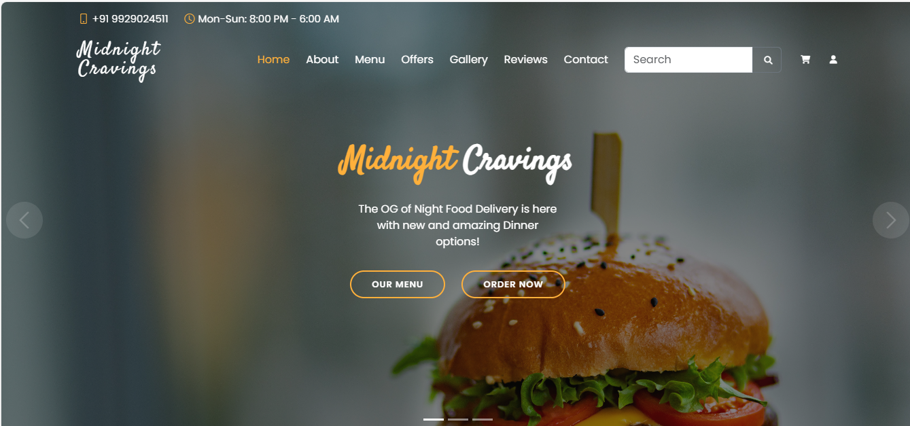
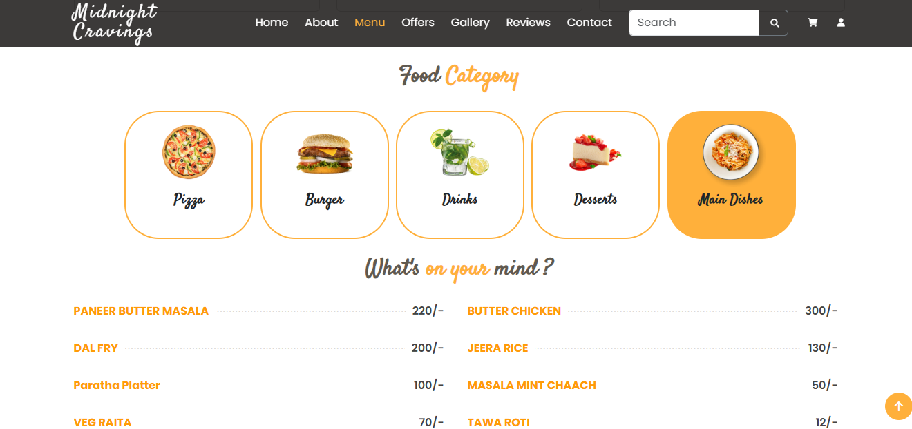

# 🍕 Midnight Cravings - Night Food Delivery Website

*Where midnight cravings meet modern design.*

**Midnight Cravings** is a modern, responsive food delivery website designed specifically for night-time cravings. Developed using **HTML5**, **CSS3**, **JavaScript**, and **Bootstrap**, this project simulates a real-world restaurant experience with visually rich galleries, customer testimonials, interactive components, and a dynamic contact section.

🌐 **Live Demo**: [https://preksha1178.github.io/midnight-cravings](https://preksha1178.github.io/midnight-cravings)  
📂 **GitHub Repository**: [https://github.com/preksha1178/midnight-cravings](https://github.com/preksha1178/midnight-cravings)

---

## ✨ Key Features

- 📱 **Mobile-First Responsive Design** – Optimized for all screen sizes
- 🍽️ **Image Gallery** – High-quality visuals of popular dishes
- ⭐ **Customer Testimonials** – Real-time review carousel using Swiper.js
- 🥘 **Chef’s Special Section** – Highlighted signature items with ratings
- 📍 **Google Maps Integration** – Embedded location for delivery service area
- 📬 **Contact Form** – Simple form layout for user inquiries
- ⚙️ **Modern UI** – Clean, engaging layout built with Bootstrap 5

---

## 🛠️ Tech Stack

- **Frontend**:  
  - HTML5  
  - CSS3  
  - JavaScript (Vanilla)

- **Libraries & Tools**:  
  - [Bootstrap 5](https://getbootstrap.com/)  
  - [Swiper.js](https://swiperjs.com/)  
  - [GLightbox](https://biati-digital.github.io/glightbox/)  
  - [Google Maps Embed](https://developers.google.com/maps/documentation/embed)

---

## 📷 Screenshots

### 🏠 Homepage

### 🍕 Menu

---

## 👩‍💻 Authors

- **Himanshi** – [GitHub Profile](https://github.com/devbyhimanshi)
- **Preksha** – [GitHub Profile](https://github.com/preksha1178)  

---

## 📜 License

This project is intended for **educational and demonstration purposes only**.  
You are welcome to use and customize the code with attribution.

---

## 🚀 How to Use

To view the website locally:

1. Clone the repo  
   `git clone https://github.com/preksha1178/midnight-cravings.git`

2. Open the folder  
   `cd midnight-cravings`

3. Open `index.html` in your browser

---

## 🙌 Acknowledgements

- UI inspiration based on [BootstrapMade](https://bootstrapmade.com/)
- Icons from [Bootstrap Icons](https://icons.getbootstrap.com/)
- Animations from [AOS Library](https://michalsnik.github.io/aos/)

---

> ⭐ *If you like this project, consider giving it a star on GitHub to support our work!*

